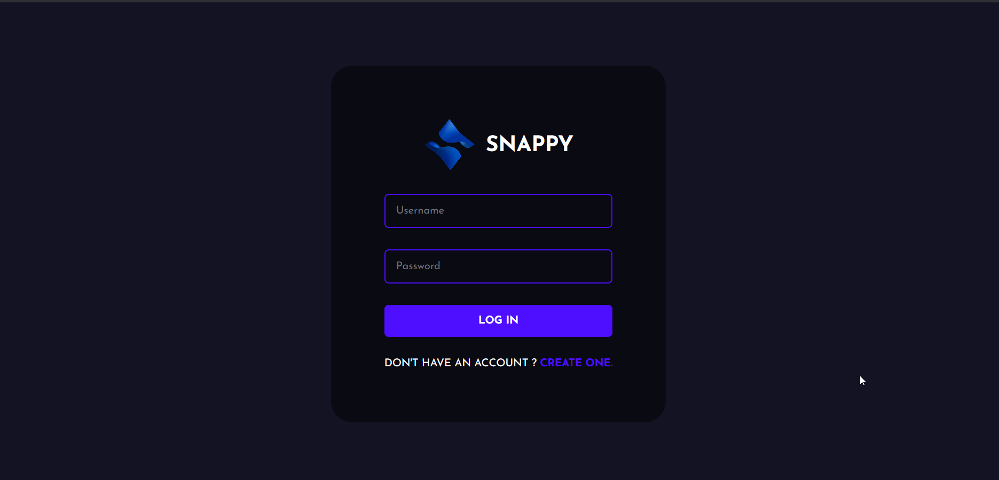

# Chatify - Real-Time Chat Application 

A modern, full-stack chat application built with the MERN stack (MongoDB, Express.js, React.js, Node.js) featuring real-time messaging, user authentication, and a beautiful responsive UI.




## ✨ Features

- 🔐 **User Authentication** - Secure login and registration
- 💬 **Real-time Messaging** - Instant message delivery using Socket.IO
- 👤 **Avatar Selection** - Customizable user avatars
- 📱 **Responsive Design** - Works on desktop and mobile devices
- 🎨 **Modern UI** - Clean and intuitive interface
- 🔒 **Secure** - Password hashing and secure authentication
- ☁️ **Cloud Database** - MongoDB Atlas integration

## 🛠️ Technologies Used

### Frontend
- React.js
- Socket.IO Client
- Styled Components
- Axios
- React Router DOM
- React Toastify

### Backend
- Node.js
- Express.js
- Socket.IO
- MongoDB/Mongoose
- bcrypt
- CORS

## 📋 Prerequisites

Before running this application, make sure you have the following installed:

- [Node.js](https://nodejs.org/) (v16 or later)
- [npm](https://www.npmjs.com/) or [yarn](https://yarnpkg.com/)
- [MongoDB Atlas](https://www.mongodb.com/atlas) account (for cloud database)

## 🚀 Quick Start

### 1. Clone the repository
```bash
git clone https://github.com/yourusername/chatify.git
cd chatify
```

### 2. Setup Environment Variables
Create `.env` files in both `server` and `public` directories:

#### Server (.env)
```bash
cd server
cp .env.example .env
```
Update the `.env` file with your MongoDB connection string:
```
PORT=5001
MONGO_URL=your_mongodb_connection_string_here
```

#### Frontend (.env)
```bash
cd ../public
cp .env.example .env
```
Update if needed (default values should work for local development):
```
REACT_APP_BACKEND_URL=http://localhost:5001
PORT=3000
```

### 3. Install Dependencies

#### Backend
```bash
cd server
npm install
```

#### Frontend
```bash
cd ../public
npm install
```

### 4. Start the Application

#### Start Backend Server
```bash
cd server
npm start
```
The backend will run on `http://localhost:5001`

#### Start Frontend (in a new terminal)
```bash
cd public
npm start
```
The frontend will run on `http://localhost:3000`

### 5. Open your browser
Navigate to `http://localhost:3000` and start chatting!

## 🐳 Docker Deployment

You can also run the application using Docker:

```bash
# Build and start all services
docker-compose up --build

# Run in background
docker-compose up -d
```

This will start:
- Frontend on `http://localhost:3000`
- Backend on `http://localhost:5001`

## 📁 Project Structure

```
chatify/
├── public/                 # React frontend
│   ├── src/
│   │   ├── components/     # Reusable components
│   │   ├── pages/         # Page components
│   │   ├── utils/         # API routes and utilities
│   │   └── assets/        # Static assets
│   ├── package.json
│   └── Dockerfile
├── server/                # Node.js backend
│   ├── controllers/       # Request handlers
│   ├── models/           # Database models
│   ├── routes/           # API routes
│   ├── index.js          # Server entry point
│   └── package.json
├── docker-compose.yml
└── README.md
```

## 🔧 Configuration

### MongoDB Setup
1. Create a [MongoDB Atlas](https://www.mongodb.com/atlas) account
2. Create a new cluster
3. Get your connection string
4. Add your IP to the whitelist
5. Update the `MONGO_URL` in your `.env` file

### Environment Variables

| Variable | Description | Default |
|----------|-------------|---------|
| `PORT` | Backend server port | 5001 |
| `MONGO_URL` | MongoDB connection string | Required |
| `REACT_APP_BACKEND_URL` | Backend API URL | http://localhost:5001 |

## 🤝 Contributing

1. Fork the repository
2. Create your feature branch (`git checkout -b feature/AmazingFeature`)
3. Commit your changes (`git commit -m 'Add some AmazingFeature'`)
4. Push to the branch (`git push origin feature/AmazingFeature`)
5. Open a Pull Request

## 📝 License

This project is licensed under the MIT License - see the [LICENSE](LICENSE) file for details.

## 👨‍💻 Author

**Your Name**
- GitHub: [@yourusername](https://github.com/yourusername)
- LinkedIn: [Your LinkedIn](https://linkedin.com/in/yourprofile)

## 🙏 Acknowledgments

- Thanks to the MERN stack community
- Socket.IO for real-time functionality
- MongoDB Atlas for cloud database hosting

---

⭐ Star this repository if you found it helpful!
```shell
cd server
yarn start
```
Done! Now open localhost:3000 in your browser.

#### Second Method
- This method requires docker and docker-compose to be installed in your system.
- Make sure you are in the root of your project and run the following command.

```shell
docker compose build --no-cache
```
after the build is complete run the containers using the following command
```shell
docker compose up
```
now open localhost:3000 in your browser.